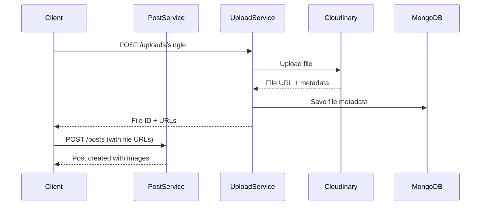

# Upload Service Integration Guide

## Overview

The Upload Service has been separated from Post Service to provide a centralized file management solution for the entire blog microservices platform.

## Architecture Changes

### Before (Monolithic Upload)
```
Post Service
├── Controllers
│   ├── PostController (with upload endpoints)
├── Services
│   ├── PostService
│   ├── CloudinaryService (upload logic)
└── Config
    └── CloudinaryConfig
```

### After (Microservice Upload)
```
Post Service                    Upload Service
├── Controllers                 ├── Controllers
│   ├── PostController          │   ├── UploadController
├── Services                    ├── Services  
│   ├── PostService             │   ├── UploadService
│   └── ContentAnalyzerService  │   ├── CloudinaryService
                                │   └── UploadClientService
                                ├── Entities
                                │   └── FileUpload (MongoDB)
                                └── DTOs
                                    └── Upload DTOs
```

## Integration Flow

### 1. File Upload Flow


### 2. Post Creation with Images
```typescript
// Step 1: Upload files first
const uploadResponse = await fetch('/api/uploads/thumbnail', {
  method: 'POST',
  headers: {
    'Authorization': `Bearer ${token}`,
    'Content-Type': 'multipart/form-data'
  },
  body: formData
});

const fileData = await uploadResponse.json();

// Step 2: Create post with file URLs
const postResponse = await fetch('/api/posts', {
  method: 'POST',
  headers: {
    'Authorization': `Bearer ${token}`,
    'Content-Type': 'application/json'
  },
  body: JSON.stringify({
    title: 'My Post',
    content: 'Post content...',
    thumbnailUrl: fileData.data.cloudinarySecureUrl,
    // ... other post data
  })
});
```

## Upload Service API

### Endpoints

#### File Upload
- `POST /uploads/single` - Upload single file
- `POST /uploads/multiple` - Upload multiple files
- `POST /uploads/thumbnail` - Upload thumbnail (optimized 800x450)
- `POST /uploads/featured` - Upload featured image (optimized 1200x630)
- `POST /uploads/content` - Upload content image
- `POST /uploads/gallery` - Upload gallery images

#### File Management
- `GET /uploads` - List files with pagination
- `GET /uploads/{id}` - Get file details
- `PATCH /uploads/{id}` - Update file metadata
- `DELETE /uploads/{id}` - Delete file
- `POST /uploads/bulk-delete` - Delete multiple files

#### Analytics
- `GET /uploads/stats` - File statistics
- `POST /uploads/{id}/download` - Track download

### Request/Response Examples

#### Upload Single File
```bash
curl -X POST \
  http://localhost:3003/uploads/single \
  -H 'Authorization: Bearer YOUR_JWT_TOKEN' \
  -H 'Content-Type: multipart/form-data' \
  -F 'file=@image.jpg' \
  -F 'type=thumbnail' \
  -F 'alt=Sample image' \
  -F 'relatedPostId=uuid-here'
```

Response:
```json
{
  "success": true,
  "message": "File uploaded successfully",
  "data": {
    "id": "file-uuid",
    "cloudinaryUrl": "https://res.cloudinary.com/...",
    "cloudinarySecureUrl": "https://res.cloudinary.com/...",
    "width": 800,
    "height": 450,
    "format": "webp",
    "size": 45678,
    "responsiveUrls": {
      "small": "https://...",
      "medium": "https://...",
      "large": "https://..."
    }
  }
}
```

## Integration with Post Service

### Environment Variables
```bash
# Post Service .env
UPLOAD_SERVICE_URL=http://localhost:3003

# Upload Service .env
MONGODB_URI=mongodb://localhost:27017/blog-uploads
CLOUDINARY_CLOUD_NAME=your-cloud-name
CLOUDINARY_API_KEY=your-api-key
CLOUDINARY_API_SECRET=your-api-secret
```

### Post Service Changes

#### Removed Endpoints
- `POST /posts/upload/thumbnail`
- `POST /posts/upload/featured`
- `POST /posts/upload/content`
- `POST /posts/upload/gallery`

#### Removed Dependencies
- CloudinaryService
- CloudinaryProvider
- Multer configuration for uploads

### Client-Side Integration

#### Frontend Upload Flow
```typescript
// 1. Upload files to Upload Service
const uploadFiles = async (files: File[], type: FileType) => {
  const formData = new FormData();
  files.forEach(file => formData.append('files', file));
  formData.append('type', type);
  
  const response = await fetch('/api/uploads/multiple', {
    method: 'POST',
    headers: { 'Authorization': `Bearer ${token}` },
    body: formData
  });
  
  return response.json();
};

// 2. Create post with uploaded file URLs
const createPost = async (postData: CreatePostDto) => {
  const response = await fetch('/api/posts', {
    method: 'POST',
    headers: { 
      'Authorization': `Bearer ${token}`,
      'Content-Type': 'application/json'
    },
    body: JSON.stringify(postData)
  });
  
  return response.json();
};

// 3. Combined workflow
const createPostWithImages = async (postData, thumbnailFile, galleryFiles) => {
  // Upload thumbnail
  const thumbnail = await uploadFiles([thumbnailFile], 'thumbnail');
  
  // Upload gallery
  const gallery = await uploadFiles(galleryFiles, 'gallery');
  
  // Create post with file URLs
  const post = await createPost({
    ...postData,
    thumbnailUrl: thumbnail.data[0].cloudinarySecureUrl,
    galleryImages: gallery.data.map(file => ({
      url: file.cloudinarySecureUrl,
      alt: file.alt,
      width: file.width,
      height: file.height
    }))
  });
  
  return post;
};
```

## Database Schema

### Upload Service (MongoDB)
```typescript
// FileUpload Collection
{
  _id: ObjectId,
  originalName: string,
  filename: string,
  mimetype: string,
  size: number,
  type: 'thumbnail' | 'featured' | 'content' | 'gallery' | 'document' | 'video' | 'audio',
  status: 'uploading' | 'success' | 'failed' | 'processing' | 'deleted',
  
  // Cloudinary info
  cloudinaryPublicId: string,
  cloudinaryUrl: string,
  cloudinarySecureUrl: string,
  width: number,
  height: number,
  format: string,
  bytes: number,
  
  // Metadata
  alt: string,
  caption: string,
  description: string,
  tags: [string],
  
  // Relations
  uploadedBy: string, // User ID
  relatedPostId: string,
  relatedCategoryId: string,
  
  // Analytics
  viewCount: number,
  downloadCount: number,
  lastAccessedAt: Date,
  
  // Timestamps
  createdAt: Date,
  updatedAt: Date
}
```

### Post Service (PostgreSQL)
```sql
-- Posts table remains the same but stores file URLs instead of handling uploads
CREATE TABLE posts (
  id UUID PRIMARY KEY,
  title VARCHAR(255) NOT NULL,
  content TEXT NOT NULL,
  thumbnail_url TEXT, -- From Upload Service
  featured_image_url TEXT, -- From Upload Service
  gallery_images JSONB, -- Array of file URLs from Upload Service
  -- ... other fields
);
```

## Migration Guide

### 1. Deploy Upload Service
```bash
# Start MongoDB
docker run -d -p 27017:27017 --name mongodb mongo:6.0

# Set environment variables
export MONGODB_URI=mongodb://localhost:27017/blog-uploads
export CLOUDINARY_CLOUD_NAME=your-cloud-name
export CLOUDINARY_API_KEY=your-api-key
export CLOUDINARY_API_SECRET=your-api-secret

# Start Upload Service
cd apps/upload-service
npm run build
npm run start
```

### 2. Update Post Service
```bash
# Remove old upload endpoints
# Update dependencies
# Deploy new version
cd apps/post-service
npm run build
npm run start
```

### 3. Update Frontend
- Change upload endpoints from `/posts/upload/*` to `/uploads/*`
- Implement two-step process: upload files first, then create posts
- Update error handling for separated services

### 4. Test Integration
```bash
# Test upload service
curl -X GET http://localhost:3003/health

# Test file upload
curl -X POST http://localhost:3003/uploads/thumbnail \
  -H "Authorization: Bearer YOUR_TOKEN" \
  -F "file=@test.jpg" \
  -F "type=thumbnail"

# Test post creation with uploaded file URL
curl -X POST http://localhost:3002/posts \
  -H "Authorization: Bearer YOUR_TOKEN" \
  -H "Content-Type: application/json" \
  -d '{"title":"Test","content":"Content","thumbnailUrl":"https://..."}'
```

## Benefits

### 1. Separation of Concerns
- Post Service: Content management
- Upload Service: File management

### 2. Scalability
- Upload Service can be scaled independently
- Specialized for file processing workloads

### 3. Reusability
- Other services (User, Comment) can use Upload Service
- Centralized file management policies

### 4. Performance
- MongoDB for file metadata (better for frequent reads/writes)
- PostgreSQL for post content (better for complex queries)

### 5. Monitoring
- Separate metrics for upload performance
- Detailed file usage analytics

## Troubleshooting

### Common Issues

1. **Upload Service not reachable**
   - Check `UPLOAD_SERVICE_URL` in Post Service
   - Verify Upload Service is running on port 3003

2. **Authentication errors**
   - Ensure JWT tokens are valid
   - Check JWT secret consistency across services

3. **File upload fails**
   - Verify Cloudinary credentials
   - Check file size limits
   - Validate file types

4. **MongoDB connection issues**
   - Check `MONGODB_URI` configuration
   - Ensure MongoDB is running
   - Verify network connectivity

### Health Checks
```bash
# Upload Service health
curl http://localhost:3003/health

# Upload Service detailed status
curl http://localhost:3003/health \
  -H "Authorization: Bearer YOUR_TOKEN"
```

## Future Enhancements

1. **Image Processing Pipeline**
   - Automatic image optimization
   - AI-powered alt text generation
   - Duplicate detection

2. **CDN Integration**
   - Multiple CDN support
   - Geo-distributed storage
   - Edge caching

3. **Analytics Dashboard**
   - File usage statistics
   - Storage optimization recommendations
   - Performance metrics

4. **Backup & Recovery**
   - Automated backups
   - Cross-region replication
   - Disaster recovery procedures